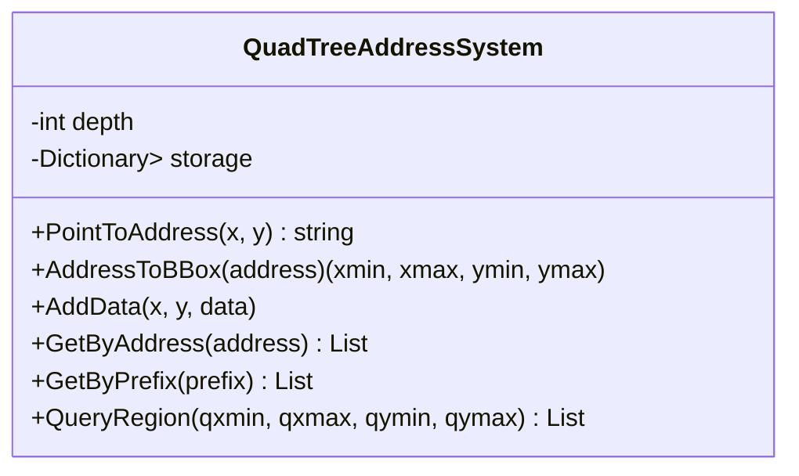
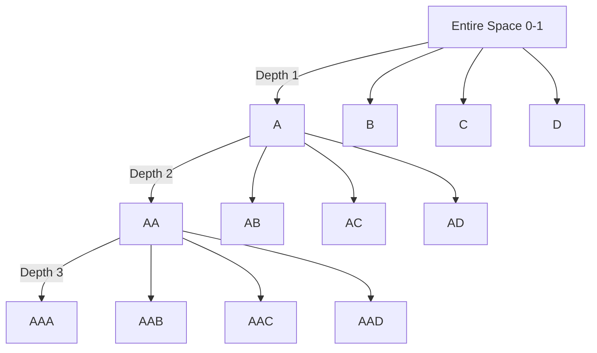

# 🌐 QuadTree Address System

**A hierarchical spatial indexing system** for efficient data addressing using recursive space partitioning into quadrants.

[](https://your-demo-link.com)
[](https://dotnet.microsoft.com)
[](LICENSE)

## 🌟 Core Idea

The system transforms spatial coordinates into **hierarchical string addresses** by recursively dividing a normalized space (0-1 in X/Y) into quadrants:

```
   Y
   ^
   | [0.5,1)  A | B [0.5,1)
   | [0,0.5)  C | D [0,0.5)
   +-----------------> X
```

Each level of recursion adds one character to the address, providing **exponentially increasing precision**:

```
Depth 1: "A" → [0.0-0.5]x[0.5-1.0]
Depth 2: "AA" → [0.0-0.25]x[0.75-1.0]
Depth 3: "AAB" → [0.125-0.25]x[0.75-0.875]
...
```

## 📊 Key Features

- 🔢 **Bi-directional conversion**
  - Coordinates → Address (`PointToAddress`)
  - Address → Bounding box (`AddressToBBox`)
- 📦 **Spatial indexing**
  - Store data at precise locations
  - Efficient region-based queries
- ⚡ **Hierarchical addressing**
  - Exact match searches (single cell)
  - Prefix searches (entire subtree)
- 🌍 **Region queries**
  - Find all data in arbitrary rectangles
  - Automatic intersection detection
- 🔄 **Auto-normalization**
  - Handles out-of-bound coordinates
  - Consistent [0,1) space mapping

## 🚀 Performance Benefits

| Operation | Complexity | Use Case |
|-----------|------------|----------|
| AddData | O(log n) | Add new data point |
| GetByAddress | O(1) | Exact cell retrieval |
| GetByPrefix | O(k) | Subtree retrieval (k=matches) |
| QueryRegion | O(n) | Spatial queries (worst-case) |

*With n total data points and k matching prefix addresses*

## 🧩 System Components

### Core Classes



### Spatial Partitioning



## 💻 Getting Started

### Installation
```bash
dotnet add package QuadTreeAddressSystem
```

### Basic Usage
```csharp
// Initialize with depth=5
var system = new QuadTreeAddressSystem(5);

// Add spatial data
system.AddData(0.3, 0.8, "Sensor A");
system.AddData(0.7, 0.2, "Device B");

// Retrieve by precise address
var address = system.PointToAddress(0.3, 0.8);
var data = system.GetByAddress(address); // ["Sensor A"]

// Search entire region
var regionData = system.QueryRegion(0.6, 1.0, 0.0, 0.5); // ["Device B"]

// Get hierarchical data
var subtree = system.GetByPrefix("A"); // All data in left half
```

## 🌐 Real-World Applications

### 🗺️ GIS Systems
- Fast geolocation lookups
- Regional data aggregation
- Zoom-level dependent rendering

### 🎮 Game Development
- Spatial object management
- Culling invisible objects
- Physics collision detection

### 📡 IoT Networks
- Sensor data indexing
- Regional device queries
- Spatial analytics

### 🚚 Logistics
- Vehicle tracking
- Route optimization
- Delivery zone management

## 📈 Performance Comparison

| System | Insert | Query | Memory |
|--------|--------|-------|--------|
| QuadTree | O(log n) | O(n) | Medium |
| R-Tree | O(log n) | O(log n) | High |
| Grid | O(1) | O(k) | Very High |
| Brute Force | O(1) | O(n) | Low |

*Balances insertion speed, query performance, and memory efficiency*

## 🧪 Testing & Validation

```csharp
[Test]
public void AddressConversion_RoundTrip_ReturnsSameValues()
{
    var system = new QuadTreeAddressSystem(5);
    var (x, y) = (0.3, 0.7);
    
    string address = system.PointToAddress(x, y);
    var (xmin, xmax, ymin, ymax) = system.AddressToBBox(address);
    
    Assert.IsTrue(x >= xmin && x < xmax);
    Assert.IsTrue(y >= ymin && y < ymax);
}
```

## 📚 Documentation

### `PointToAddress(x, y)`
Converts normalized coordinates (0-1 range) to hierarchical address

**Parameters**:
- `x`: X coordinate (0 ≤ x < 1)
- `y`: Y coordinate (0 ≤ y < 1)

**Returns**: String address (e.g., "ABDC")

### `AddressToBBox(address)`
Converts address to bounding box

**Parameters**:
- `address`: Valid quadrant string

**Returns**: Tuple (xmin, xmax, ymin, ymax)

### `QueryRegion(qxmin, qxmax, qymin, qymax)`
Finds all data intersecting with rectangular region

**Parameters**:
- Bounding box coordinates

**Returns**: Flat list of matching objects

## 🚧 Limitations & Future Work

- **Current**: 2D space only
- **Planned**: 
  - 3D octree extension
  - Nearest-neighbor search
  - Bulk insertion operations
  - Persistence layer
  - Parallel query processing

## 👥 Contribution Guidelines

1. Fork the repository
2. Create feature branch (`git checkout -b feature/improvement`)
3. Commit changes (`git commit -am 'Add feature'`)
4. Push to branch (`git push origin feature/improvement`)
5. Open pull request

## 📜 License

MIT License - see [LICENSE](LICENSE) for details.